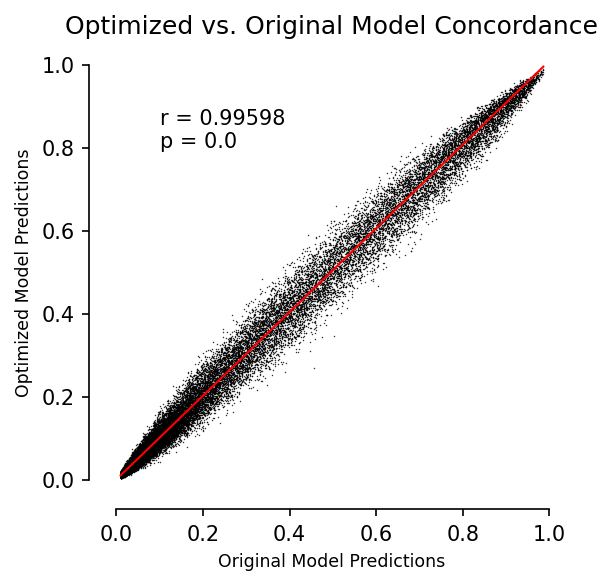

### **Overview**
This is a major update to the UCDeconvolve API. This update features an overhauled user registration system that enables independent user registration, verification, and API key management. Core API services have been expanded to include, in addition to UCDBase, UCDExplain, and UCDSelect fine-tuning services. The API is now designated as feature-complete, and has been upgraded to beta status. 

```{note}
Please note that significant development work is still underway, and aspects of this software may be changed at any time without notice. 
```

See details on major updates below:

### **Central API Server**
All user management, job requests, progress, and results are managed by a central API server that serves as authentication and communication layer between end-users and backend prediction services.

### **User Registration / Authentication**
Users are now free to register to receive an API key independently and will immediately receive API keys upon activation of their accounts. The entire registration process is now integrated into the core API and can be done programmatically. See tutorials for how registration works in additional detail.

### **Integration of UCDExplain and UCDSelect**
Full functionality of UCDExplain and UDCSelect fine-tuning is now available. UCDExplain leverages integrated gradients to return feature attributions associated with prediction of a given cell type from the UCDBase model with a given input (i.e. gene). UCDSelect allows transfer learning of UCDBase embedding weights to enable contextualized deconvolution results when combined with an appropriate reference dataset. Prebuilt references have been made available for access, and dozens more are planned to be added in due time. For details on using UCDExplain and UCDSelect, see tutorials.

### **Improvements to UCDBase**
Performance of the existing UCDBase context-free deconvolution function has been improved with two key changes.

1. Data submitted for deconvolution is preprocessed client-side and uploaded to the central API server prior to initiation of prediction, which is in contrast to prior approach which involve streaming batch chunks directly and waiting for batch prediction responses. This approach offers improvements in performance and reliability. No user data is kept, and all submitted data is deleted immediately following completion of a prediction job.
2. We have redeployed UCDBase using the ONNX ML platform. The base model used for prediction is a performance-optimized derivative of the original UCDBase model, which offers superior performance for large datasets. We show a comparison of correlations for original vs. optimized model performance and note high concordance:



### **Improvements to Utilities / Plotting**
Numerous new plotting functions and utilities have been added to streamline the UCDeconvolve prediction process. These include new methods for generating visualizations of spatial deconvolution and feature-attribution plots as shown in the original manuscript. For more details, see updated tutorials section.

### **Under the Hood Improvements**
Many more improvements were made to improve the usability, stability, and performance of the underlying UCD package, that lay a foundation for continued improvement over time.